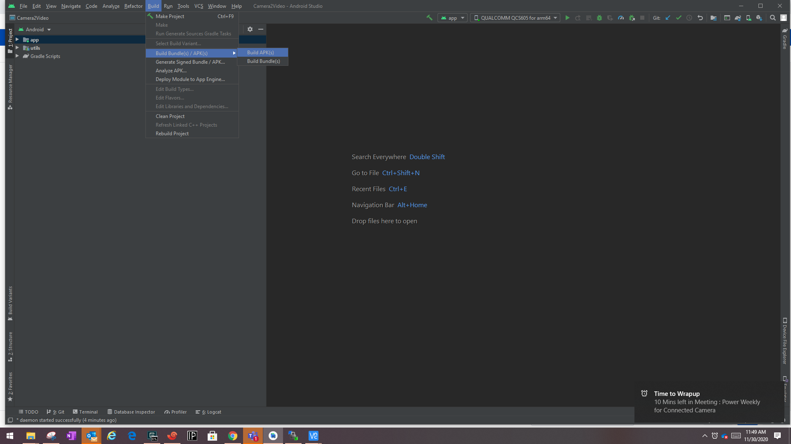
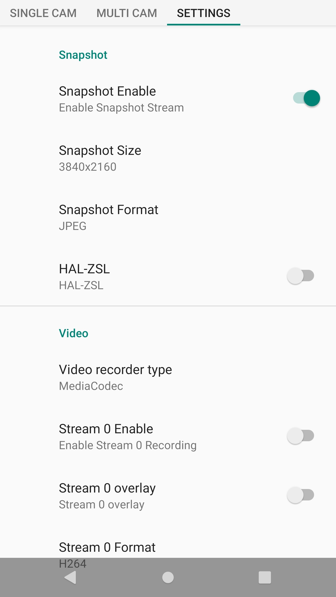

IoT APK Camera2Video for QCS610 and QCS605 Platforms
===========================


## Table of contents
--------------
  * [Description](#Description)
  * [Pre-requisites](#Pre-requisites)
  * [Code download](#Code-download)
  * [Release history](#Release-history)
  * [Getting Started](#Getting-Started)
     * [Compile IoT APK](#Compile-IoT-APK)
  * [IoT APK Camera2Video features](#IoT-APK-Camera2Video-features)
     * [IoT APK Camera2Video basic features](#IoT-APK-Camera2Video-basic-features)
         * [SINGLE CAM tab](#SINGLE-CAM-tab)
         * [MULTI CAM tab](#MULTI-CAM-tab)
         * [SETTINGS tab](#SETTINGS-tab)
     * [Change settings back to defaults](#Change-settings-back-to-defaults)
     * [Change dynamic camera parameter](#Change-dynamic-camera-parameter)
  * [IoT APK Camera2Video use cases](#IoT-APK-Camera2Video-use-cases)
     * [Major IOT use cases](#Major-IOT-use-cases)
     * [LDT Testing](#LDT-Testing)
     * [Frame Skip Interface](#Frame-Skip-Interface)
     * [Shared Streams](#Shared-Streams)
         * [Rescaled Stream](#Rescaled-Stream)
         * [Linked Stream](#Linked-Stream)
     * [SHDR](#SHDR)
     * [LDC](#LDC)
     * [Enable 360 camera](#Enable-360-camera)
  * [References](#References)
     * [Related documentation](#Related-documentation)
     * [Resources](#Resources)
     * [Acronyms and terms](#Acronyms-and-terms)

<br />

## Description
--------------
Camera2Video is an Android application (app) that is developed for QCS610 and QCS605 platforms.<br />
The current version of the Camera2Video application is 3.2.0.<br />
This is a generic Android application based on the [Camera2 API][1] and written in Kotlin supported on Android 10. This application is designed to help end users in terms of use case realization for IoT domain.<br />

[1]: https://developer.android.com/reference/android/hardware/camera2/package-summary.html


## Pre-requisites
--------------
- Android SDK 29
- Android Studio 4.1.1
- Android Gradle Plugin Version 3.6.3
- Gradle Version 6.1.1
- QCS610 or QCS605 device with image sensors as per usecase


## Code download
--------------
Code is now hosted at CAF. To clone or copy the code, run the following command:

```
git clone https://source.codeaurora.org/quic/la/camera-samples -b iot-concam-apk.lnx.1.1
```
The client gets the camera-samples folder in the current directory.
```
$ ls -al
total 12
drwxr-x---  3 users users 4096 Nov 20 10:06 .
drwxrwxr-x 20 users users 4096 Nov 20 14:24 ..
drwxr-x--- 11 users users 4096 Nov 26 20:21 camera-samples
```

To change to the camera-samples directory, run the following command:<br />
```
cd camera-samples/Camera2Video
```
Camera2Video is the QTI-modified project for implementing IoT use cases.

## Release history
--------------

Code release history:
* [IoT APK release 3.1.0][8]
* [IoT APK release 1.4.0][7]
* [IoT APK release 1.3.0][2]
* [IoT APK release 1.2.0][3]
* [IoT APK release 1.1.0][4]
* [IoT APK release 1.0.0][5]

[2]: https://source.codeaurora.org/quic/la/camera-samples/commit/?h=iot-concam-apk.lnx.1.1&id=a2b555eb7a807983404402065df5644a413b3365
[3]: https://source.codeaurora.org/quic/la/camera-samples/commit/?h=iot-concam-apk.lnx.1.1&id=20146e951e7b87eedb84191711ca4e5011824ac7
[4]: https://source.codeaurora.org/quic/la/camera-samples/commit/?h=iot-concam-apk.lnx.1.1&id=ab668319c9b16fb064225550a518b072708f115f
[5]: https://source.codeaurora.org/quic/la/camera-samples/commit/?h=iot-concam-apk.lnx.1.1&id=95d1b0d493e35cf044077f0057f17093a008647a
[7]: https://source.codeaurora.org/quic/la/camera-samples/commit/?h=iot-concam-apk.lnx.1.1&id=fe56b515b7fe1f603404c5805df2fcff18aad6be
[8]: https://source.codeaurora.org/quic/la/camera-samples/commit/?h=iot-concam-apk.lnx.1.1&id=dc952a895fea5ee387b0f240c2348496589655c1


## Getting Started
--------------

### Compile IoT APK

This sample uses the Gradle build system. To compile IoT APK, follow these steps:
1.	Install the latest version of Android Studio: [https://developer.android.com/studio/install][6]. The following screen is displayed after installation:<br />

2.	Click **Open an Existing Project** and enter the path of **/\<Windir>/camera-samples/Camera2Video** that is copied from the Linux machine.<br />
 <br />
The project opens in Android Studio.
3.  Go to **File > Project Structure** and select **29** for **Compile SDK Version**.<br />

4.	Go to **Tools > AVD Manager > Create a Virtual Device**. <br />
5.	Set up a device and select **29** for the **API version**. After configuration, the following screen is displayed.<br />

6.	Build the APK.<br />

7.	Run the APK to AVD by using the following option. Click the **Run app** button at the top of the screen.<br />


NOTE:	Android Studio will take care of downloading the required dependency. so the first time it will take some time for downloading the dependency required for the project.<br />


[6]: https://developer.android.com/studio/install


## IoT APK Camera2Video features
--------------
This chapter explains the features of IoT APK Camera2Video app for QCS610 and QCS605 platforms.

### IoT APK Camera2Video basic features

This section covers the basic features of the IoT APK Camera2Video application based on the following tabs:
* SINGLE CAM tab
* MULTI CAM tab
* SETTINGS tab


#### SINGLE CAM tab

This screen is for recording video and capturing snapshot for a single camera. The camera can be front or back based on the **Camera IDs** setting selected from the **SETTINGS** tab. Media goes to the DCIM/Camera folder. It is possible to selectively choose to enable preview, snapshot and record functionality. It has the following features:<br />

- **Record button**: It is green by default. When tapped, the button turns to red, which indicates that the recording is in progress. To stop the recording, press the button again. The minimum duration of a video recording is 1 second.
- **Chronometer**: The chronometer is hidden by default and displays the time elapsed since the recording started.
- **Snapshot button**: Users can tap on the button to get the snapshot. App can capture snapshot in between recording video.
- **Thumbnail button**: The thumbnail button displays the last recorded video or captured snapshot. It shows a default icon on launch. When tapped, it leads to the gallery to view the media from where the user can return by pressing the back button.


<br />

#### MULTI CAM tab

This screen is for taking capture and record video from the multiple cameras. Media goes to the **DCIM/Camera** folder. It is possible to selectively choose to enable preview, snapshot and record functionality. It has the following features:
- **Record button**: It is green by default. When tapped, the button turns to red, which indicates that the recording is in progress. To stop the recording, press the button again. It records videos simultaneously from every camera. The minimum duration of a video recording is 1 second.
- **Chronometer**: The chronometer is hidden by default and displays the time elapsed since recording started.
- **Snapshot button**: Users can tap the button to capture multiple images (one from every camera) simultaneously. Users can take snapshots in between recording too.
- **Thumbnail button**: It shows a default icon always. When tapped, it leads to the gallery to view the media from where the user can return by tapping the **Back** button.

<br />

#### SETTINGS tab

The setting tab helps to configure various options for the app. Please find the small description of individual settings items.<br />



<br />


##### Camera

- **Camera IDs**: This field is used to select available cameras―front, back, or logical cameras (if supported).
- **EIS Enable**: Toggle Electronic Image Stabilization feature (Note: Platform and hardware should support EIS capabilty for this to work).
- **LDC Enable**: Toggle Lens Distortion Correction (Dewarping) of Wide Angle lens (Note : Platform and hardware should support LDC capabilty for this to work).
- **SHDR Enable**: Staggered High Dynamic Range
- **FPS**: This field is used to select camera FPS on which camera sensor will be configured.

##### Display

- **Display**: This option helps to disable preview for SINGLE CAM and MULTI CAM tabs.
- **Preview Overlay**: Enable Preview Overlay.

##### Snapshot

- **Snapshot Enable**: This field helps to enable or disable the snapshot on all tabs.
- **MJPEG Enable**: This field helps to enable or disable the MJPEG feature.
- **Snapshot Size**: This field helps to select snapshot resolution for the available camera.
- **Snapshot Format**: Currently, it supports JPEG and RAW.
- **HAL-ZSL**: This field helps to enable or disable HAL-ZSL.

##### Video

- **Video recorder type**: Currently MediaCodec and MediaRecorder are supported
- **Stream 0 Enable**: This check box enables video stream 0 with the intended video encode options available.
- **Stream 0 Overlay**: Enables or disables the overlay.
- **Stream 0 Format**: H264 and H265 are supported.
- **Stream 0 FPS**: This is to select fps for encoding content.
- **Stream 0 Bitrate**: Target bitrate in bits per second for compressed streams.
- **Stream 0 - I Frame Interval**: I frame occurrence after P frames.
- **Stream 0 - I Frame Initial QP**: Quantization parameter on I-frames for compressed streams.
- **Stream 0 - B Frame Initial QP**: Quantization parameter on B-frames for compressed streams.
- **Stream 0 - P Frame Initial QP**: Quantization parameter on P-frames for compressed streams.
- **Stream 0 - I Frame Min QP Range**: Minimum QP value allowed on I-Frames during rate control for compressed streams.
- **Stream 0 - I Frame Max QP Range**: Maximum QP value allowed on I-Frames during rate control for compressed streams.
- **Stream 0 - B Frame Min QP Range**: Minimum QP value allowed on B-Frames during rate control for compressed streams.
- **Stream 0 - B Frame Max QP Range**: Maximum QP value allowed on B-Frames during rate control for compressed streams.
- **Stream 0 - P Frame Min QP Range**: Minimum QP value allowed on P-Frames during rate control for compressed streams.
- **Stream 0 - P Frame Max QP Range**: Maximum QP value allowed on P-Frames during rate control for compressed streams.
- **Stream 0 - RC Mode**: Bitrate control method for compressed streams.
- **Stream 0 - Audio Format**: Audio format for encode.
- **Stream 0 - Size**: This field is used to select the resolution from the supported options.<br />
NOTE:	Similar descriptions are applicable for Stream 1 and Stream 2.

##### Storage
- **Store Video File**: Enable or disable storage for Video Stream. This can be used for LDT tests.
##### Multi Camera
- **Dual Camera**: Choose two cameras in MULTI CAM tab.
- **Three Camera**: Choose three cameras in the MULTI CAM tab. Third camera provides only RAW snapshot.
##### Camera Feature
- **Defog Table**: Upload the json file containing the Defog Table.
- **Exposure Table**: Upload the json file containing the Exposure Table.
- **ANR Data**: Upload the json file containing the ANR Data.
- **Local Tone Mapping**: Upload the json file containing the LTM Table.
- **Exposure Value**: Select the proper EV from list.
##### Version Info
- This will tell us the version of the app.

### Change settings back to defaults

To reset the app back to its default state, re-install the app. Alternatively, follow the steps as shown in the screenshots by clearing the storage.<br />
NOTE: Provide permissions to the app again.


<br />

### Change dynamic camera parameter

The Camera2Video app supports changing camera parameter dynamically as well. To access the parameters, the user must tap the screen.<br />


<br />

The following table lists the set of Android tags.<br />
| Control name | Android tag | Vendor tag (if applicable) | Description |
|-|-|-|-|
| AE Lock | CONTROL_AE_LOCK | ― | Whether auto-exposure (AE) is currently locked to its latest calculated values. |
| AWB Lock | CONTROL_AWB_LOCK | ― | The desired mode for the camera device's auto-exposure routine. |
| ADRC Disable | NA | org.codeaurora.qcamera3.adrc | Automatic dynamic range compression |
| Defog | NA | org.quic.camera.defog.* | Defog Table |
| Exposure Table | NA | org.codeaurora.qcamera3.exposuretable.* | Custom Exposure Table |
| ANR Table | NA | org.quic.camera.anr_tuning.* | Adaptive Noise Reduction Tuning |
| LTM Table | NA | org.quic.camera.ltmDynamicContrast.* | Local Tone Mapping |
| AE Mode | CONTROL_AE_MODE | ― | Whether auto white balance (AWB) is currently locked to its latest calculated values. |
| AWB Mode | CONTROL_AWB_MODE | ― | Whether auto white balance (AWB) is currently setting the color transform fields, and what its illumination target is. |
| Saturation Level | NA | org.quic.camera.ltmDynamicContrast. | Saturation Level |
| Sharpness Level | NA | org.codeaurora.qcamera3.sharpness.strength | Sharpness Level |
| Noise Reduction Mode | NOISE_REDUCTION_MODE | ― | Mode of operation for the noise reduction algorithm. |
| AntiBanding | CONTROL_AE_ANTIBANDING_MODE | ― | The desired setting for the camera device's auto-exposure algorithm's antibanding compensation. |
| AF Mode | CONTROL_AF_MODE | ― | Whether auto-focus (AF) is currently enabled, and what mode it is set to. |
| IR LED Mode | NA | org.codeaurora.qcamera3.ir_led.mode | Only ON/OFF is supported. |
| Exposure Metering Mode | NA | org.codeaurora.qcamera3.exposure_metering.exposure_metering_mode | Sets the Exposure metering mode. |
| ISO Mode | NA | org.codeaurora.qcamera3.iso_exp_priority | Sets the ISO mode. |
| Zoom | SCALER_CROP_REGION | NA | Zoom feature |
<br />

## IoT APK Camera2Video use cases
--------------
The following table provides the complete list of IoT uses cases of Camera2Video app.

### Major IOT use cases

| Use case | Description | Settings required in the app |
|-|-|-|
| Single Camera:<br>One Encode and One preview | This use case is to exercise the one encoded stream and one preview stream. | Go to the SETTINGS tab.<br>From the settings mentioned above, select disabled for the Stream 1 and Stream 2 enable option.<br>Select Stream 0 resolution and other params.<br>Go to the SINGLE CAM tab.<br>Press the Recording button. |
| Single Camera:<br>Two Encode and One preview | This use case is to exercise the two encoded streams and one preview stream. | Go to the SETTINGS tab.<br>From the settings mentioned above, select disabled for the Stream 2 enable option.<br>Select Stream 0 and Stream 1 resolution and other params.<br>Go to the SINGLE CAM tab.<br>Press the Recording button. |
| Single Camera:<br>3 Encode | This use case is to exercise the 3 encoded streams. | Go to the SETTINGS tab.<br>From the setting mentioned in Chapter 5, select Enable for the Stream 0/1/2 enable option.<br>Select Stream 0, Stream 1 and Stream 2 resolution and other params.<br>Go to the SINGLE CAM tab.<br>Press the Recording button. |
| Single Camera:<br>One Preview and One Snapshot | This use case is to exercise the one snapshot<br>and one preview stream. | Go to the SETTINGS tab.<br>Enable Snapshot Stream.<br>Select proper stream resolution from Snapshot resolution.<br>Select Snapshot format as JPEG/RAW.<br>Go to the SINGLE CAM tab.<br>Press the Capture button. |
| Dual Camera:<br>Total Two Preview Stream (One per Camera) and<br>Total Two encoded streams (One per Camera) and<br>Total Two Snapshot streams (One per Camera) | This use case is to exercise total two Preview Stream (One per Camera), total of two encoded streams (One per Camera) and total two Snapshot Stream(One per Camera) | Go to the SETTINGS tab.<br>Enable Snapshot Stream.<br>Select proper stream resolution from Snapshot resolution (applicable for both cameras)<br>Select Snapshot format as JPEG.<br>From the setting mentioned above, select disable for the Stream 1 Enable and Stream 2 Enable option.<br>From the preceding setting, select enable for the Stream 0 Enable option.<br>Select the proper stream resolution for Stream 0 (applicable for both cameras) and other params.<br>Go to the MULTI CAM tab.<br>Press the Video capture button.<br>NOTE:   Users can take a snapshot in between. |
| Dual Camera:<br>Total Four encoded streams (Two per Camera) and<br>Total Two Snapshot streams (One per Camera) | This use case is to exercise total of four encoded streams (Two per Camera) and total of two Snapshot Stream (One per Camera) | Go to the SETTINGS tab.<br>Enable Snapshot Stream.<br>Select a proper stream resolution from Snapshot resolution (applicable for both cameras).<br>Select Snapshot format as JPEG.<br>Disable the Display option.<br>From the preceding setting, select disable for the Stream 2 Enable option.<br>From the setting mentioned above, select enable for the Stream 0 and Stream 1 Enable option.<br>Select the proper stream resolution for Stream 0/ Stream 1 (Applicable for both cameras) and other params.<br>Go to the MULTI CAM tab.<br>Press the Video capture button.<br>NOTE:   The app allows us to take snapshots in between. |
| Three Camera:<br>Whatever is supported with 2 camera on top of it app can open the third camera. From the third camera, we can only take RAW stream. | Same as Dual Camera use case | Go to the SETTINGS tab.<br>Enable Snapshot Stream.<br>Select a proper stream resolution from Snapshot resolution (applicable for both cameras).<br>Select Snapshot format as JPEG (as of now, this is the only format supported])<br>From the preceding setting, select disable for the Stream 1 and Stream 2 Enable option.<br>From the setting mentioned above, select enable for the Stream 0<br>Select the proper stream resolution for Stream 0<br>Select the Multi Camera as Three Camera. [the third camera only creates a raw stream, which can be tested with a capture image.]<br>Go to the MULTI CAM tab.<br>10. Press the Video capture button. |

### LDT Testing
End Client can disable "Store Video File" to run the LDT use case.

<br />


### Frame Skip Interface

FrameSkip implementation enables user to have lesser(Desired) fps for the encoded stream.<br />
Suppose Sensor is streaming at 30 fps and user needs a stream of say 15 fps. So user can enable this by setting the correct fps in setting of that stream.<br />

**This will work if you have enabled overlay on that stream with desired FPS.**<br />


### Shared Streams

#### Rescaled Stream

Rescaler implementation enables the end user to create a rescaled stream which is generated using OPENGL ES. It will use this interface to get shared stream from camera and finally it will pass through OPENGL ES interface for rescaling.<br />
This will work if you have enabled overlay on that stream with desired stream resolution.
Resolution should be different [Less] from the source.<br />


##### Use Case

Display  : 1920 * 1080 [From Camera]<br />
Snapshot : Off <br />
Stream 0 : 3840 * 2160 @30 [From Camera]<br />
Stream 1 : 1920 * 1080 @30 [From Camera]<br />
Stream 2 : 640 * 480 @ 30    [We need to enable overlay here.] [This is the rescaled use case.] [Stream 1 and Stream 2 will share buffer and finally Stream 2 will go through OPENGL ES for rescaler.]<br />

############################################<br />

Display    : 1920 * 1080 [From Camera]<br />
Snapshot : Off <br />
Stream 0  : 3840 * 2160 @30 [From Camera]<br />
Stream 1 : 640 * 480 @ 30     [We need to enable overlay here.] [This is the rescaled use case.] [Stream 1 and Stream 2 will share buffer and finally Stream 1 will go through OPENGL ES for rescaler.]<br />
Stream 2 : 1920 * 1080 @30  [From Camera]<br />

############################################<br />

#### Linked Stream

Linked stream implementation enables end user to have one more stream whose buffers are being shared with source stream. It will use this interface for buffer sharing.<br />
This will work if you have configured streams with similar resolution.<br />


##### Use Case

Display    : 1920 * 1080 [From Camera]<br />
Snapshot : Off <br />
Stream 0 : 1920 * 1080 @30 [From Camera]<br />
Stream 1 : 640 * 480 @30 [From Camera]<br />
Stream 2 : 640 * 480 @30 [Stream 1 and Stream 2 will share buffer] [No need to enable overlay if FPS is same as Stream 1]<br />

############################################<br />
```
NOTE FOR SINGLE CAM TAB
Camera can only generate 3 streams as we have those pipelines available in CAMX.
Rescaled Stream and Linked Stream configuration will only works for Stream 1 and Stream 2 if Display is enable and snapshot is disabled for Single Cam use case.
if snapshot and display is enabled, then Stream 0/1/2 will be considered as shared stream based on resolution.
If display and snapshot is off, then all the stream [0/1/2] are from camera in single camera use case.
Shared streams are kept from in the order Stream 2/1/0.
```
```
NOTE FOR MULTICAM TAB
Camera can only generate 3 streams as we have those pipelines available in CAMX.
Rescaled Stream and Linked Stream configuration will only works for Stream 0 and Stream 1 if Display and snapshot is enable for Dual Cam use case.
If display and snapshot is on, then all the stream [0/1] and snapshot stream are from camera in dual camera use case.
For Dual camera tab only Stream 0 and Stream 1 configurations are valid.
```

##### Dual Camera Use Case Example

Display    : 1920 * 1080 [From Camera]<br />
Snapshot Stream: [From Camera]<br />
Stream 0 : 1920 * 1080 @30 [From Camera]<br />
Stream 1 : 640 * 480 @30 [We need to enable overlay] [Stream 0 and Stream 1 will share buffer] [This is the rescaled use case.] [Stream 0 and Stream 1 will share buffer and finally Stream 2 will go through OPENGL ES for rescaler.]<br />

######################################<br />

Display    : 1920 * 1080 [From Camera]<br />
Snapshot Stream: [From Camera]<br />
Stream 0 : 1920 * 1080 @30 [From Camera]<br />
Stream 1 : 1920 * 1080 @30 [Stream 0 and Stream 1 will share buffer] [This is the  linked stream use case.] [Stream 0 and Stream 1 will share buffer]<br />

######################################<br />

Display    : Display is off.<br />
Snapshot Stream:                  [From Camera]<br />
Stream 0 : 1920 * 1080 @30 [From Camera]<br />
Stream 1 : 1920 * 1080 @30  [From Camera]<br />

######################################<br />


### SHDR

Device used: QCS610 with IoT SoC with IMX334 sensor.

#### Test v3.8

1.	Go to Settings -> Enable SHDR -> Set Resolution for Stream 0 \[Video\] and Snapshot as 4k or 1080p.
2. Disable all other Streams that is Stream 1 and Stream 2.
3.	Push the camx override settings to device.
```
IFEDualClockThreshold=600000000
```
4.	Run ```adb reboot```.
5. Go to **SINGLE CAM** to capture.

##### Use case tested
- One preview 1080p@30 and one encode 4k@30 with sHDR enabled
- One preview 1080p@30 and one JPEG of 4k/1080p resolution with sHDR enabled


#### Test v2

1. Go to Settings -> Enable SHDR -> Set Resolution for Stream 0 \[Video\] and Snapshot as 4k or 1080p.
2. Disable all other Streams that is Stream 1 and Stream 2.
3. Now close the app.
4. Push the camx override settings to device.
```
IFEDualClockThreshold=600000000
shdrModeType=1
outputFormat=0
```
5. setprop to use for 4k and 1080p
```
adb shell setprop persist.vendor.camera.shdr2.use.fast.kernel 1
```
5.	Run ```adb reboot```.
6. Go to **SINGLE CAM** to capture.

### LDC
User must tap the LDC Enable button from the SETTINGS tab and run the use case.<br />
Only the following streams should be created.
```
Preview + Snap || Preview + One Encode || 2 Encode
```
NOTE:	Tested with IoT APK.

### EIS
User must tap the EIS Enable button from the SETTINGS tab and run the use case.<br />
Only the following streams should be created.
```
Preview + Stream 0 1080p + Snapshot 1080p
```
NOTE:	Tested with IoT APK.


### Enable 360 camera
Device used: QCS605 RD HP device with  dual IMX557 sensors.
#### Common steps
1.	To enable the 360 camera, use the following commands:
```
adb root
adb disable-verity
adb reboot
adb root
adb remount
```
2.	Push the following camx override settings in camx override file:
```
IFEDualClockThreshold=600000000
multiCameraEnableFront=TRUE
multiCameraEnable=TRUE
outputFormat=0
```
3.	Run the following commands:
```
adb reboot
adb root
adb remount
adb shell setenforce 0
adb shell setprop persist.vendor.camera.privapp.list "com.android.example.camera2.video"
adb shell setprop vendor.camera.aux.packagelist "com.android.example.camera2.video"
adb shell setprop persist.camera.privapp.list "com.android.example.camera2.video"
```
4.	Open the IoT APK app.
5.	Go to the **SETTINGS** tab and tap **Back (4)** for **camera id** as follows:<br />


NOTE: Follow the preceding common steps to enable the 360 camera before testing and/or implementing 360 use cases.


#### [Preview ONLY]: [Side-by-side copy in camera back end]
To enable Preview ONLY mode:
1.	Tap the 3840 × 2160 option for Snapshot resolution as follows:<br />
2. Disable Encode streams<br />
3.	Tap the SINGLE CAM tab and user can see preview.<br />

#### [One encode and One preview]: [Side-by-side copy in camera back end]
To enable One encode and One preview mode:
1.	Enable only Stream 0 and set its resolution to 4096 × 2048 as follows:<br />
2.	Tap the SINGLE CAM tab and press the Start button.<br />

#### [One preview and snapshot]: [Side by side copy in camera backend]
To enable One preview and snapshot mode:
1.	Go to the SINGLE CAM tab and take picture.<br />


## References
--------------
See the following sections for document references and a list of acronyms and terms used in this document.

### Related documentation


| Document title | DCN | Description |
|-|-|-|
| QCS605/QCS603 Device Specification   | 80-PD250-1 | § Lists device descriptions, key   features, pin definitions, electrical specifications, and mechanical   information for QCS605 and QCS603 chipsets. |
| QCS605/QCS603 Camera Overview | 80-PF105-2 | § Provides an overview of Camera ISP   features and enhancements, image quality improvements, and software overview   of QCS605 and QCS603 chipsets. |
| QCS610/QCS410 Data Sheet  | 80-PL052-1 | § Provides features, pin definitions,   mechanical and electrical device characteristics of QCS610/ QCS410 chipsets. |
| QCS610/QCS410   Technical Reference Manual | 80-PL052-3 | § Provides hardware designers with   the complete information on how to design applications using QCS610/QCS410   chipset.<br />§ Provides details on Fastboot configuration, external boot   devices, and forced USB boot, and secure boot.<br />§ Provides list of peripherals and interface support, external   memory support, multimedia and connectivity interfaces, and IC-level   interfaces. |
| QCS610/QCS410 Linux Platform Development   Kit Software Reference Manual | 80-PL631-100 | § Details QCS610/QCS410 features,   software architecture, QCS610/QCS410 and Linux PDK software use cases,   connectivity information, and system debugging methods for common issues. |
| QCS610/QCS410 Linux Platform Development   Kit Software Programming Guide | 80-PL631-200 | § Provides details on how to   configure the QTI metadata and flash the device; gives details on debug tools   and techniques as well as build commands for non-HLOS; and procedure to   collect RAM dumps. |
| QCS610.LE.1.0   Release Notes  | RNO-201002072655 | § Provides details on image download,   build environment, and build instructions.<br />§ Provides instructions (and references) on how to download   QTI-proprietary software from QTI ChipCode portal, download open-source   HLOS software, generate HLOS software images, and configure memory.<br />§ Lists the new features, limitations, and new/ongoing/closed   issues in this release. |

### Resources

| Resource | Link/other details | Description |
|-|-|-|
| Android   Debug Bridge | https://developer.android.com/studio/command-line/adb | ADB tool |
| Android   Studio | https://developer.android.com/studio/install | Android Studio installation link |
| Code   Aurora | https://source.codeaurora.org | Link to Code Aurora for copying   the code |

### Acronyms and terms

| Acronym or   term | Definition |
|:-:|:-:|
| ADB | Android Debug Bridge |
| API | Application programming interface |
| APK | Android application package |
| EIS | Electronic Image Stabilization |
| IoT | Internet of things |
| LDC | Lens distortion correction |
| QTI | Qualcomm Technologies, Inc. |
| sHDR | Staggered high-dynamic range |
